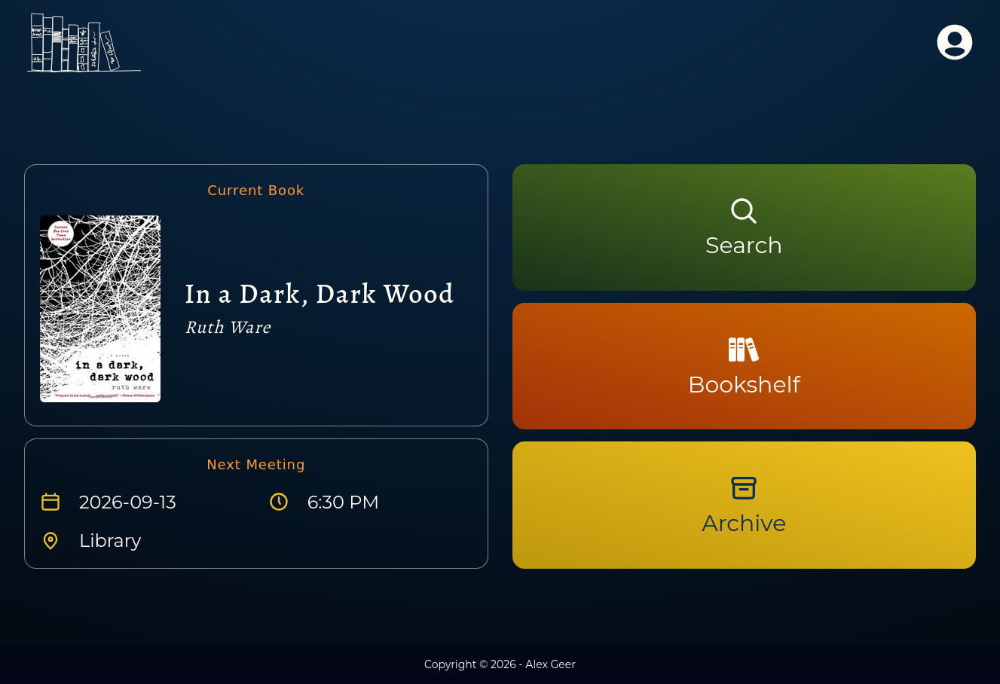
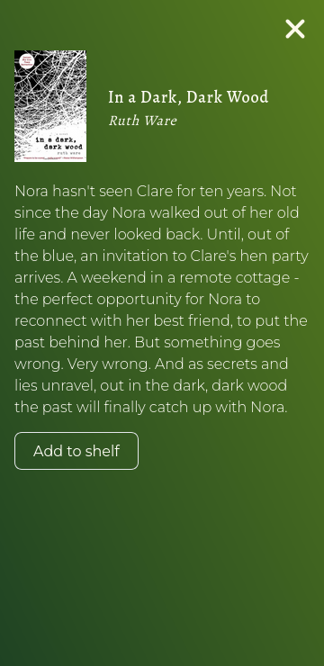
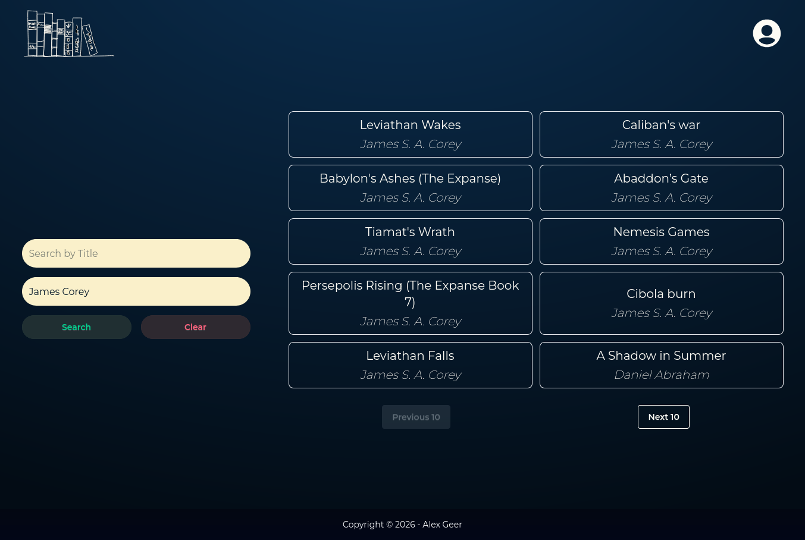
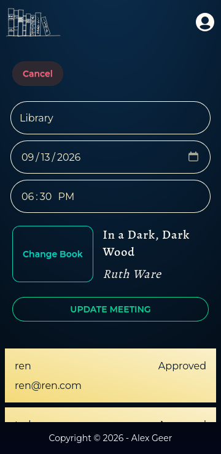
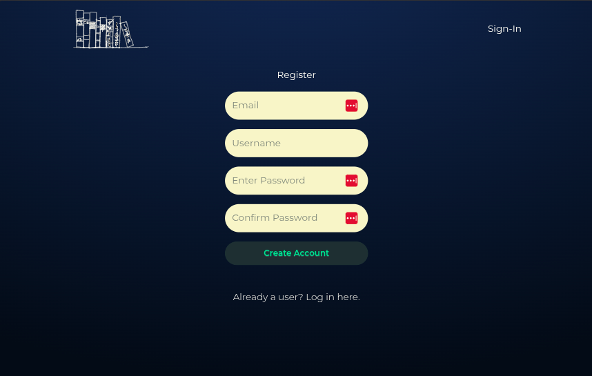

# Bookclub UI

A full-stack book club management application built with React, Vite, and Tailwind CSS. Users can create accounts, search for books via the Open Library API, and contribute to a common bookshelf. Administrators can manage member access and configure upcoming meeting details — including book selection, location, date, and time — which are displayed on the member dashboard.

This project was built for use with an active book club and as a demonstration of modern frontend development practices.

---

## Screenshots

| Mobile View                                                        | Full Screen                                                 |
| ------------------------------------------------------------------ | ----------------------------------------------------------- |
|       |    |
|  |  |
|             |       |

---

## Features

- User authentication and account creation via Supabase Auth
- Role-based access control (member vs. admin)
- Admin approval flow for new user registrations
- Book search powered by the [Open Library API](https://openlibrary.org/developers/api)
- Meeting management: admins set book, location, date, and time
- Meeting details displayed on the member dashboard
- Toast notifications for user feedback

---

## Future Features

- Members vote on books to read
- Altcha verification for new user signup
- Add mini book cover images to search results (?)

---

## Tech Stack

**Frontend**

| Technology             | Version |
| ---------------------- | ------- |
| React                  | 19      |
| Vite                   | 6       |
| Tailwind CSS           | 3       |
| DaisyUI                | 5       |
| React Router           | 7       |
| React Toastify         | 11      |
| React Icons            | 5       |
| PostCSS / Autoprefixer | —       |

**Backend**

| Technology       | Details                                       |
| ---------------- | --------------------------------------------- |
| Supabase         | PostgreSQL database, Auth, Row Level Security |
| Open Library API | External book search (no key required)        |

---

## Backend Overview

The backend is built entirely on [Supabase](https://supabase.com), encompassing a relational PostgreSQL schema, Supabase Auth integration, Row Level Security (RLS) policies, and a suite of custom database functions.

**Schema**

Four tables manage the core domain:

- `profile` — extends Supabase Auth users with `username`, `is_approved`, and `is_admin` flags
- `book` — stores books added by users, with a `finished` flag to distinguish active shelf items from archived reads
- `meeting` — links a scheduled meeting to a book, date, time, and location
- `vote` — associates users with books for suggestion/voting purposes

**Custom PostgreSQL Functions**

Nine custom functions handle business logic that could not be expressed through standard RLS alone:

- **Token enrichment** (`custom_access_token_hook`, `open_access_hook`, `attach_profile_to_token`) — intercept and enrich JWT claims with `is_admin` and `is_approved` flags sourced from the profile table, making role-aware access control available on both client and server
- **Auth trigger** (`handle_new_user`) — a `SECURITY DEFINER` trigger that automatically creates a profile row on user signup, pulling `username` from signup metadata
- **Data retrieval** (`get_books_with_users`, `get_bookshelf_books`, `get_archived_books`, `get_user_profiles`) — purpose-built functions that join book and profile data, returning shaped result sets to the frontend
- **Admin action** (`update_profile_approved`) — a guarded function that verifies the caller's JWT `is_admin` claim before executing an approval update, enforcing admin-only access at the database level

---

## Getting Started

### Prerequisites

- Node.js >= 20.17.0
- A [Supabase](https://supabase.com) project with the required schema and functions
- Yarn (recommended) or npm

### Installation

```bash
git clone https://github.com/agDesignz/bookclub_ui.git
cd bookclub_ui
yarn install
```

### Environment Variables

Copy the example file and fill in your Supabase credentials:

```bash
cp .env.example .env
```

```env
VITE_SUPABASE_URL=your_supabase_project_url
VITE_SUPABASE_ANON_KEY=your_supabase_anon_key
```

### Development

```bash
yarn dev
```

### Production Build

```bash
yarn build
yarn preview
```

---

## Project Structure

```
src/
├── assets/
├── components/
├── pages/
├── hooks/
├── lib/            # Supabase client setup
└── main.jsx
```

---

## License

[Creative Commons Attribution-NonCommercial 4.0 International (CC BY-NC 4.0)](https://creativecommons.org/licenses/by-nc/4.0/)

You are free to share and adapt this project for non-commercial purposes with attribution. Commercial use is not permitted.
